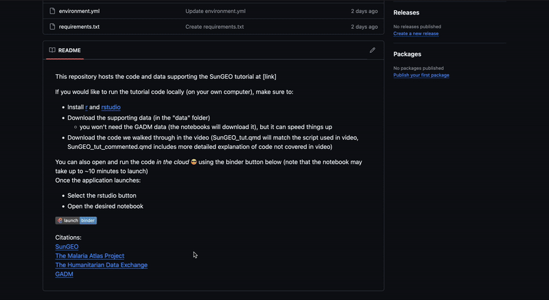

This repository hosts the code and data supporting the SunGEO tutorial at [link]

If you would like to run the tutorial code locally (on your own computer), make sure to:
- Install [r](https://www.r-project.org/) and [rstudio](https://posit.co/download/rstudio-desktop/)
- Download the supporting data (in the "data" folder)
  - you won't need the GADM data (the notebooks will download it), but it can speed things up
- Download the code we walked through in the video (SunGEO_tut.qmd will match the script used in video, SunGEO_tut_commented.qmd includes more detailed explanation of code not covered in video)

You can also open and run the code *in the cloud* :sunglasses: using the binder button below (note that the notebook may take up to ~10 minutes to launch if it hasn't been used in a while)   
Once the application launches:   
- Select the rstudio button
- Open the desired notebook
  

     
             
    
[SunGEO](https://www.sungeo.org/)    
[The Malaria Atlas Project](https://data.malariaatlas.org/trends?year=2022&metricGroup=Malaria&geographicLevel=admin0&metricSubcategory=Pf&metricType=rate&metricName=incidence)   
[The Humanitarian Data Exchange](https://data.humdata.org/dataset/health-facilities-in-sub-saharan-africa?)    
[GADM](https://gadm.org/)    
